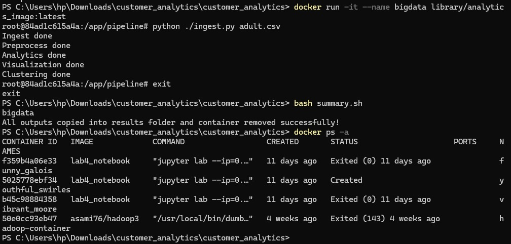
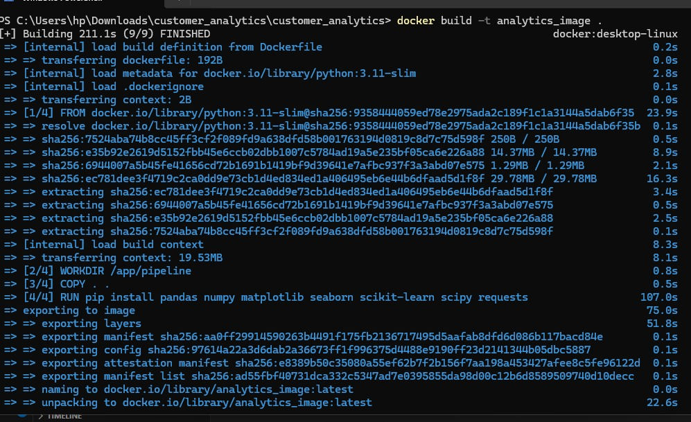
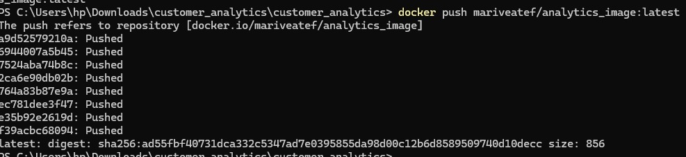

# Customer Analytics Project

## 📌 Description
This project analyzes customer data using Python and Docker.

## 🚀 Features
- Data ingestion
- Data preprocessing
- Generate insights
- Data visualization
- Clustering

## 🛠️ Technologies Used
- Python
- Pandas
- NumPy
- Matplotlib
- Scikit-learn
- Docker

## ▶️ How to Run

### 1. Build Docker Image
docker build -t analytics_image .

### 2. Run Container
docker run -it --name analytics_container analytics_image

### 3. Inside Container
python ingest.py adult.csv

### 4. Outputs
Check results folder for:
- data_raw.csv
- data_preprocessed.csv
- insights
- clusters
- summary plot

## 👨‍💻 Authors
- Yasser Helal
- Habiba

### Build Image

### Run Container

### Push Image

